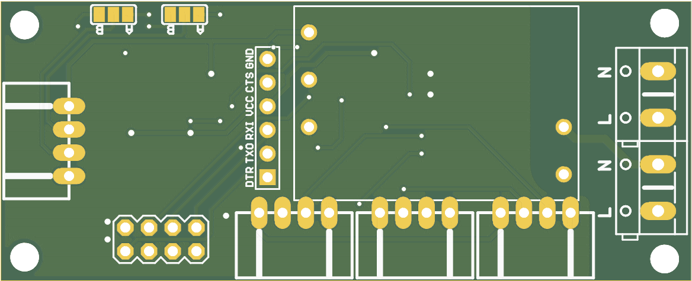
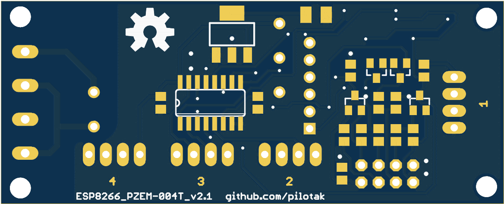

# ESP_PZEM
Board based on ESP8266-01 provides serial between with single or multiple PZEM-004T (with multiplexing). Built-in auto reset feature when uploading (GPIO0 is LOW)

## BOM
### Single PZEM
Qty | Value |Package
---|:---|:---
2 | 100n | 0805
1 | 100uF/6.3V | SMC_B
2 | SS16 | DO214AC
1 | ESP01S | ESP-01
1 | FTDI_CONN | PINHEAD-6 
2 | BSS138 | SOT23
8 | 10K | 0805
1 | AC-DC-3.5W | AC-DC-3.5W
1 | LM1117-3.3 | SOT223
2 | KF301-5.0-2P | KF301-5.0-2P
1 | S4B-XH-A-1 | JST-XH-04-RIGHT-ANGLE

### Up to 4 PZEMs
add to above

Qty | Value |Package
---|:---|:---
1 | 100n | 0805
1 | 74HC4052D | SO16
1 | 10K | 0805
3 | S4B-XH-A-1 | JST-XH-04-RIGHT-ANGLE